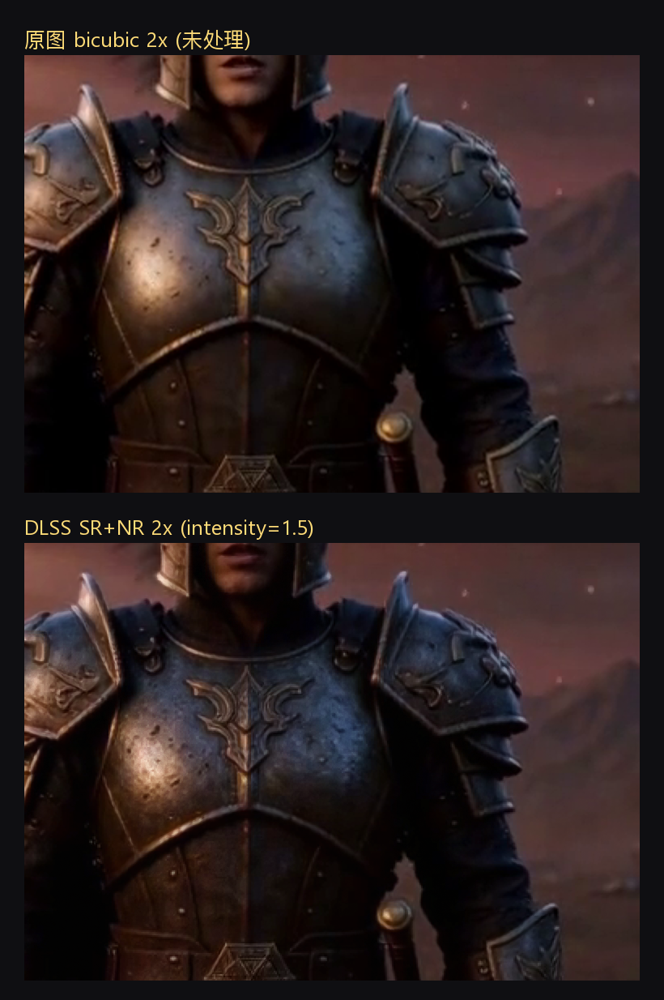
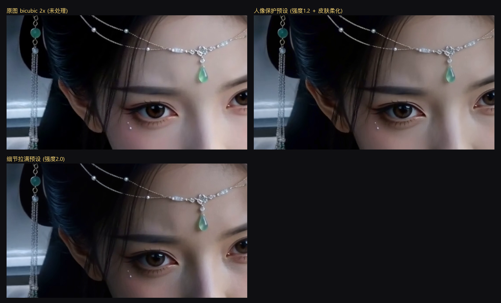
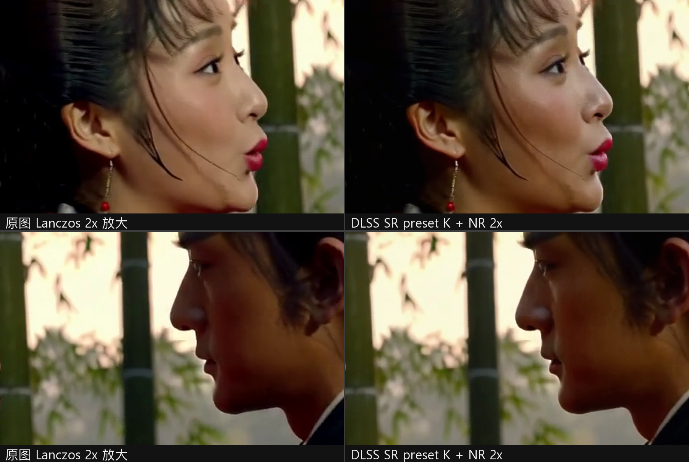
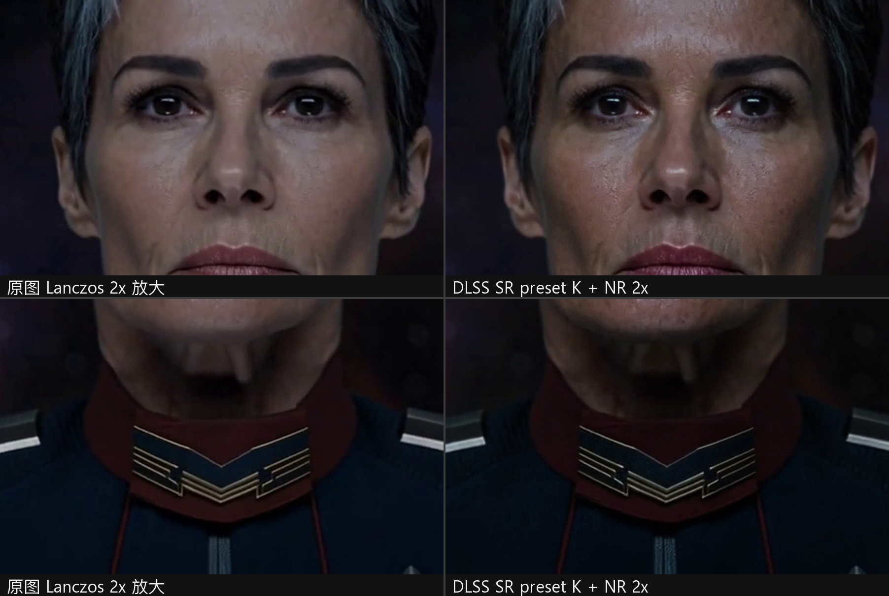
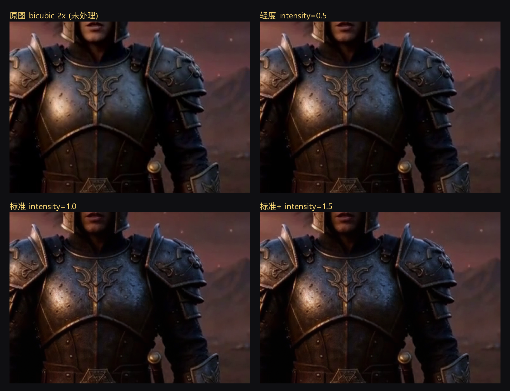
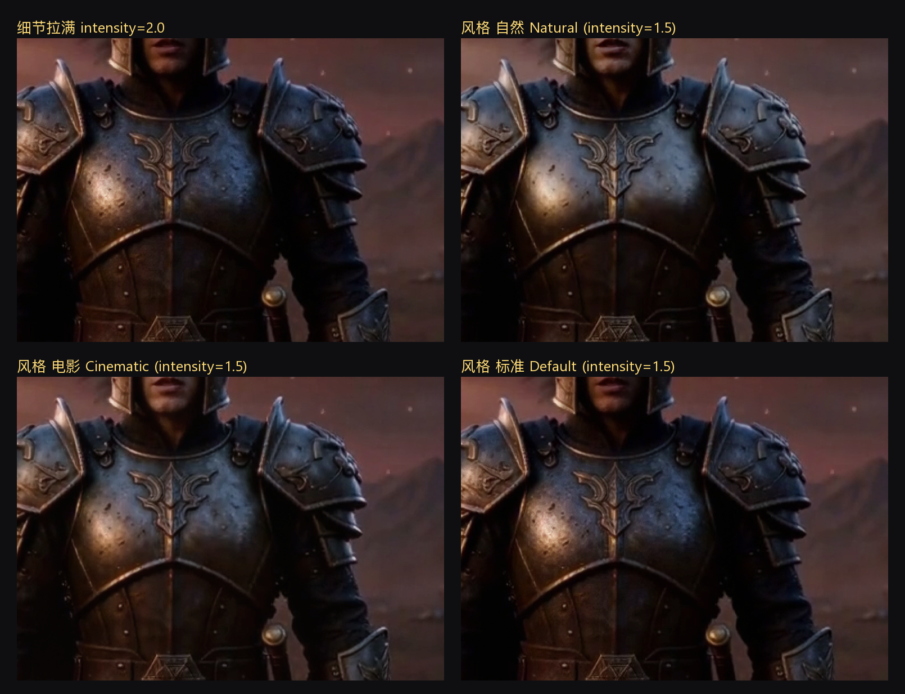

# ComfyUI-DLSS-NR

用 NVIDIA 的 DLSS 超级分辨率 + Neural Rendering（NGX feature 18，DLSS 5 那一代）给 AI 生成的图片和视频做超分和画质增强。

跑在 RTX 4090 上，1080p 输出的视频超分大约 **40~55 帧/秒**，一段 10 秒的 480p 视频几秒钟处理完。全流程 GPU，帧不落盘。



上图：原图 bicubic 放大（左） vs 本插件 DLSS SR+NR 2x（右）。注意铠甲上的雕刻纹路和金属磨损细节。

### 人像特写效果

1376×768 的人像特写镜头，2 倍超分。额饰的珍珠链、眉毛、睫毛都拉开了层次；「人像保护」预设专门控制了皮肤处理——细节上去了，皮肤没有"磨皮感"，这是和「细节拉满」最大的区别。人像素材建议用前者。



### v0.5 新增：SR 模型选择（transformer 锐利预设）

v0.5 移植了上游 v1.3 的 `--nr-sr-preset`，可以在多档 DLSS 超分模型里选：default=驱动自动选（最新 transformer），E/F=CNN 更平滑，J/K/L/M=transformer 更锐。下面两张图用 1376×768 的视频帧 2 倍超分，SR 模型选 **K**（transformer 锐利档）+ NR 强度 1.5，左边是 Lanczos 放大的原图对照。

竹林外景人脸：睫毛、发丝、耳环珠链在 DLSS 侧拉开了层次，唇线和皮肤纹理更干净；男侧逆光轮廓的边缘振铃也压住了。



暗光科幻人像：低照度噪点被 NR 抹平的同时，眉毛、眼睑和领口金属纹章的棱线反而更锐——transformer 模型在暗场上"细节重建 vs 降噪"的平衡比传统放大明显。



## 这是什么

两个 ComfyUI 节点，底层调用 [video2dlssnr](https://github.com/DaniilSokolyuk/video2dlssnr)（ DaniilSokolyuk 的 DLSS5 命令行工具，在此致谢）：

- **DLSS NR 视频超分**：填一个视频路径（或接 VIDEO 输入），整段视频流式过 GPU，出来就是放大+增强后的 mp4，音轨保留。
- **DLSS NR 图片超分**：接 IMAGE batch，出去还是 IMAGE batch。支持两种模式：无关图片各处理各的；同一视频拆出来的帧可以用"帧序列"模式，一次会话流过，带时域连续。

支持放大 1~4 倍。倍率选 1 就是不放大、只做原生分辨率的神经细节增强。

## 效果与参数

### 强度（intensity）

从 0.5 到 1.5，铠甲的纹理和划痕逐渐"长"出来。这就是 NR 神经渲染在重建材质细节，不是简单锐化。



intensity 拉到 2.0 是最猛的一档，另外两种风格（自然/电影）效果也不一样：



- 人像素材建议强度 ≤1.5，再配合皮肤参数，避免"加工脸"
- 风景、建筑、机甲、盔甲这类材质丰富的内容可以拉满

### 预设

不想调参的话，节点顶部有一键预设：

| 预设 | 干什么用 |
|---|---|
| 自定义 | 下面所有滑杆生效 |
| 轻度增强 | 接近原图，只轻微提质 |
| 标准增强 | 日常推荐，强度 1.5 |
| 细节拉满 | 强度 2.0，效果最猛 |
| 人像保护 | 自然风格 + 皮肤柔化，防加工脸 |
| 夜景电影 | 电影风格 + 高强度，适合暗场 |

### 其他参数

| 参数 | 说明 |
|---|---|
| 放大倍率 / 输出宽度 | 1/1.5/2/3/4 倍，或直接指定输出宽度 |
| SR 模型 | DLSS 超分模型选择：default=驱动自动选（最新 transformer）；E/F=CNN 更平滑；J/K/L/M=transformer 更锐 |
| NR 风格 | 标准 / 自然 / 电影感 |
| 强度 / 细节 / 色彩 | NR 三个核心旋钮 |
| 皮肤 / 局部结构 / 局部色调 / 全局色调 | 精调：皮肤处理、纹理锐度、光影对比、整体明暗 |
| 自动遮罩 | 保护画面里的文字、UI、字幕区域 |
| 光流引擎（视频） | auto 会用 NVOFA 硬件光流，画面异常再换 lk |
| 显卡选择 | 双卡用户可以把超分丢给副卡，-1 自动 |
| 编码器 / CQ | hevc/h264/av1（NVENC）、prores（剪辑软件直读）、ffv1（无损母带）、av1_svt（CPU） |
| 位深 | 10-bit 渐变更平滑（天空/暗场少色带），8-bit 兼容性最好 |
| 码率 / NVENC 预设 | 0=按 CQ 恒定质量；也可以指定目标码率、p1~p7 速度档 |
| 音频 | 自动保留 / 原样复制 / 指定编码 / 去掉音轨 |

每个参数鼠标停上去都有中文提示（系统是英文环境时自动显示英文）。

## 安装

```
ComfyUI/custom_nodes/ComfyUI-DLSS-NR/
```

1. 克隆或下载本仓库到上面的目录
2. 运行一键安装（在插件目录里）：

```
python install.py
```

它会自动从上游 [video2dlssnr v1.3 release](https://github.com/DaniilSokolyuk/video2dlssnr/releases)（该版本已打包全部组件）下载并安装四件套：

- `video2dlssnr.exe`
- `nvngx.dll_dlssnr.dll`
- `nvngx_dlss.dll`
- `nvngx_dlssnr.dll`

全部文件都从原作者的官方 release 页面拉取，本仓库不分发任何二进制。已装好的文件不会重复下载；`--force` 可以强制重新下载。

3. 视频节点需要系统有 ffmpeg：`winget install Gyan.FFmpeg`（图片节点不需要）
4. 重启 ComfyUI，加一个图片节点、勾上"运行前自检"跑一次，确认环境没问题

## 环境要求

- Windows 10/11 x64
- NVIDIA RTX 显卡（20 系到 50 系都可以，越新越快）
- 驱动 **616.56 或更新**（旧驱动不支持 Neural Rendering，会直接报错）

## 常见问题

| 现象 | 原因和办法 |
|---|---|
| `could not load forwarder nvngx.dll_dlssnr.dll` | 四个文件没放齐，缺了转发器 |
| `UnableToInitializeFeature 0xBAD0000B` | 驱动太旧，升到 616.56+ |
| 图片节点报错并附一段"环境诊断" | 按诊断里标 MISSING 的文件补齐 |
| 输出没变大 | 检查放大倍率是不是 1（1 是纯增强不放大） |
| 人脸看着"加工感"重 | intensity 降到 1.2 以下，皮肤参数调低 |

## 说明

- 只在 Windows + NVIDIA RTX 上工作，不支持 AMD/Intel
- 图片节点每批一次会话；帧序列模式整批共用一次会话，速度更快
- 本仓库的代码是 MIT 协议。`video2dlssnr.exe` 和 NVIDIA 的 DLL 归各自作者/公司所有，请自行获取，本仓库不分发
